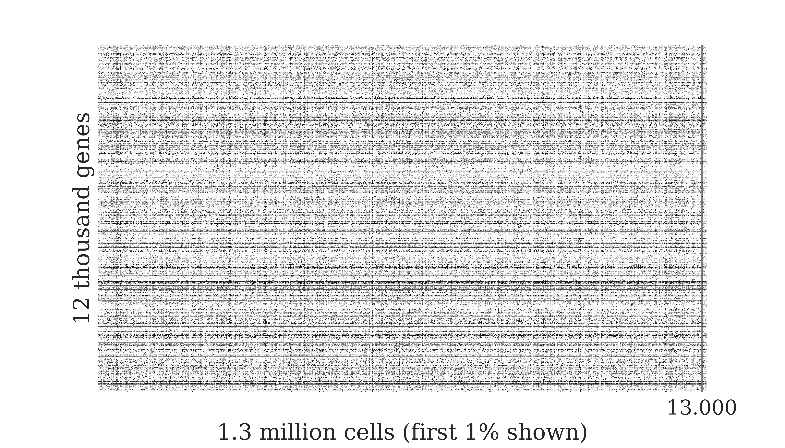
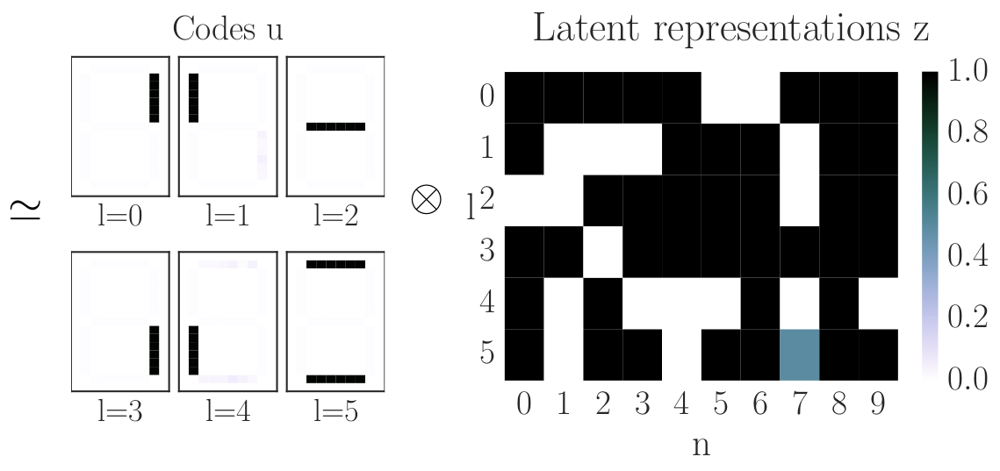
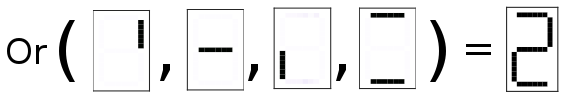

# Motivation

## Single Cell Gene Expression

# Boolean Matrix Factorisation

## Intuition for Boolean Matrix Factorisation

$$ $$

## Probabilistic Generative Model
$$p(\underbrace{x_{nd}}_{\substack{\text{obser-} \\ \text{vation}}}|\overbrace{\mathbf{u}_d}^{\text{codes}},\underbrace{\mathbf{z}_n}_{\substack{\text{latent}\\ \text{rprsnt.}}},\overbrace{\lambda}^{\substack{\text{disper-}\\ \text{sion}}})= \begin{cases} \big(1+\exp[-\lambda]\big)^{-1};\;&\text{if}\;\color{darkgreen}{x_{nd}=\min(1,\mathbf{z}_n^T\mathbf{u}_d)}\;\; \\ \big(1+\exp[\lambda]\big)^{-1};\;&\text{else} \end{cases} \\ = \sigma_{\substack{\text{logistic} \\ \text{sigmoid}}}\left[\lambda \underbrace{\tilde{x}_{nd}}_{\tilde{x} = 2x-1} \left(1-2\color{brown}{\prod\limits_{l}(1-z_{nl}u_{ld})}\right) \right]$$
