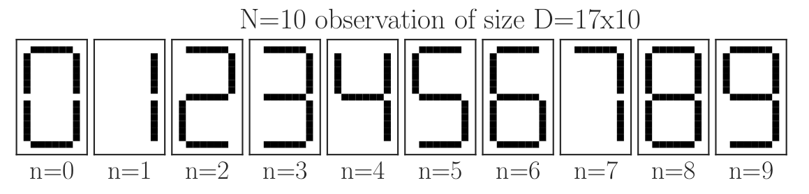

# Include code

## Here is some code
```python
print("hello world")
```

# Include images

## Size can be given in curly brackets
``` {height=100px} ```
{height=200px}


# Mutiple columns are done using html
<div class="column" style="float:left; width: 50%">
col1
</div>
<div class="column" style="float:left; width: 50%">
col2
</div>


# LaTeX support

## LaTeX for maths rendering
* requires ```--mathjax``` option
* Inline with ```$x^2$```: $x^2$
* Single line with ```$$\sqrt{x}$$```: $$\sqrt{x}$$
